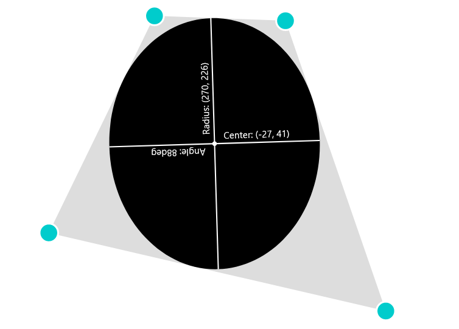

# 2D Convex Quadriliteral to Ellipse Conversion

A 3-dimensional scene can be rendered by projecting the geometry from 3D space onto a 3-dimensional plane. The proportion of the geometry may be distorted in the process to achieve a perspective effect. Especially circles are being squished into ellipses when being projected. But the exact relation between the size and position of a circle and 3D space and the resulting size and position of the projected ellipse is not that straight-forward as one might think.

So when rendering a 3D scene containg circular shapes one could simply first discretizing the circle into line segments and then projecting only theses segments with is easily done by just transforming the end-points of each segment. But discretizing smooth shapes to early might reduce later image quality.

So the better alternative might be to project the smooth circular shape from 3-dimensions into the correct smooth 2-dimensional ellipse. Christopher Brierley Jones describes the process on his website. The idea is instead of projecting the circle, to project it's bounding rectangle and then find the matrix that transforms that resulting quadriliteral into a unit square. Then extract the parameters of the ellipse from this matrix. The key insight is that for each convex quadriliteral is exactly one largest ellipse that fits it perfectly (by being tangential on all 4 sides). And the perspective projection of the bounding rectangle is always a convex quadriliteral.

But I could not find any showcase implementation or ready to use code of this approach online so I implemented it myself according to Christopher Brierley Jones notes. So feel free to play around by morphing the circle above or use my implementation. My implementation is licensed under MIT